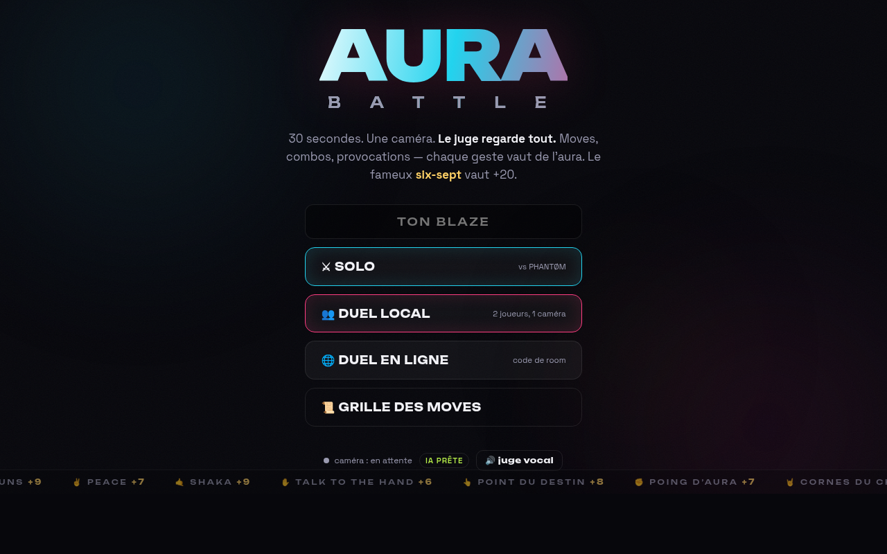
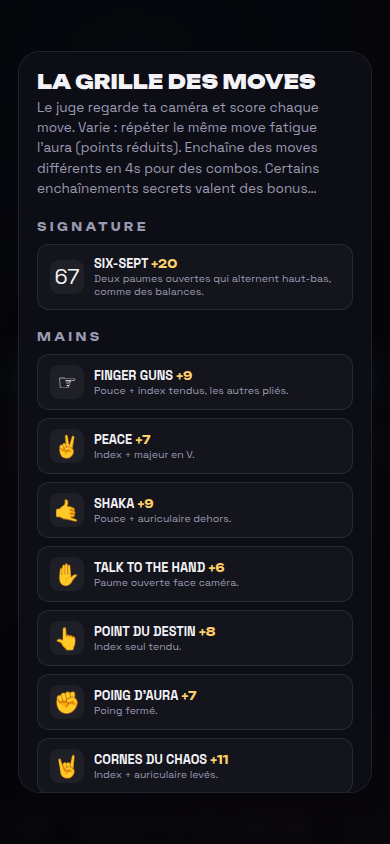

# ⚡ AURA BATTLE

Battle d'aura 1v1 jugée par une IA qui regarde ta caméra. 30 secondes, chaque move vaut des points, le plus gros stock d'aura gagne.



## Lancer

```bash
npm install
npm run dev
```

→ `http://localhost:5174` (localhost = contexte sécurisé, la caméra marche en HTTP).

**Sur mobile** (même Wi-Fi) : la caméra exige du HTTPS hors localhost →

```bash
npm run dev:mobile
```

puis ouvre `https://<ip-du-pc>:5174` sur le téléphone et accepte le certificat auto-signé.

## Modes

- **SOLO** — contre PHANTØM, un bot qui rubber-bande (il accélère s'il perd).
- **DUEL LOCAL** — 2 joueurs devant 1 caméra, chacun sa moitié d'écran.
- **DUEL EN LIGNE** — WebRTC via PeerJS : l'hôte crée un code à 4 lettres, le challenger le saisit (ou ouvre le lien `#CODE`).

## Le jeu

- **26 moves** détectés en temps réel : le **SIX-SEPT** (+20, deux paumes qui alternent), dab, T-pose, finger guns, shaka, bras croisés, double biceps, squat slave, smize, cri de guerre, duck face… La liste complète est dans « Grille des moves ».


- **Combos** : moves distincts en 4s = bonus. Des enchaînements secrets (dab → T-pose = *Transition Alpha*, finger guns → point = *Double Tap*…) rapportent gros.
- **Fatigue** : spammer le même move réduit ses points (le juge se moque).
- **Événements aléatoires** : aura ×2, move interdit (-8), stase (l'immobilité paie), prochain move +15.
- **Le Juge** : commente à voix haute (synthèse vocale FR, désactivable) et tranche.

## Technique

- **Détection 100% on-device** : MediaPipe `tasks-vision` (HandLandmarker ×4 mains, PoseLandmarker ×2, FaceLandmarker blendshapes). Aucune frame ne quitte le navigateur ; les modèles `.task` + wasm sont téléchargés automatiquement par `postinstall` (`scripts/setup-assets.mjs`) et servis en local.
- Throttle adaptatif : la cadence d'inférence s'ajuste si l'appareil est lent.
- Squelette neon dessiné en overlay canvas par-dessus la vidéo mirroirée.
- Online : PeerJS (data channel pour les moves + scores, media stream pour voir l'adversaire). Chaque client détecte les moves de son propre joueur et envoie le total — le score rapporté fait foi.
- SFX en WebAudio pur, zéro asset.

## Debug

`?debug` — panneau de triggers manuels par joueur. `?novision` — désactive les modèles (mode démo sans caméra).

## Licence

[GPL-3.0](LICENSE) — © Mattéo Pollet. Les modèles MediaPipe restent sous leur licence Google.
